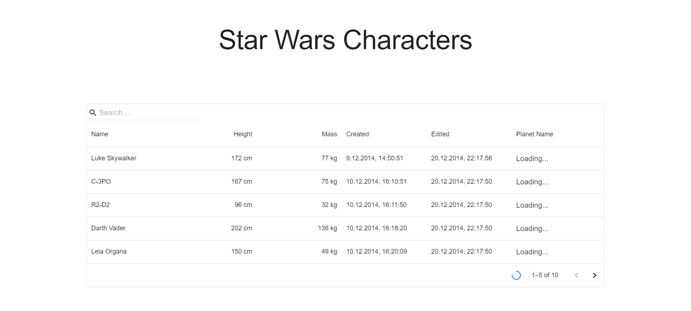
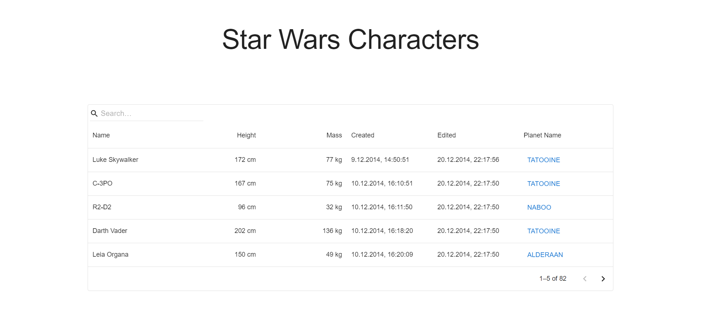

# SW API Characters Data Grid

This application showcases characters from the Star Wars API (SW API). Users can filter characters by name and sort them based on columns. As the SW API provides paginated character data, the app employs a loop to fetch data, enabling client-side sorting. Additionally, planet data is loaded asynchronously to enhance the user experience by unblocking the interface and allowing seamless interaction. It's worth considering creating a proxy server to serve all the data needed quicker and upgrade user experience.

## Appliaction Loading

## Loaded Application

## Application start

1. Install the project dependencies using npm: 
   `npm instal` 

2. To run the application in development mode, use the following command: 
   `npm run dev`
